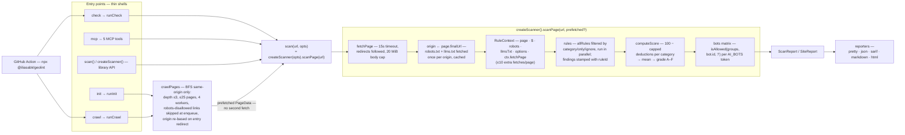

# Architecture

How geolint turns a URL into a scored audit report: the scan pipeline, the
rule contract, the scoring model and the robots.txt engine — plus every place
the project is designed to be extended.

Audience: contributors. For dev setup, tests and PR process see
[CONTRIBUTING.md](../CONTRIBUTING.md); for the generated rule catalogue see
[docs/rules.md](rules.md); for rule authoring see
[docs/writing-rules.md](writing-rules.md).

## Pipeline overview

Every entry point is a thin shell over one function:
`scan()` / `createScanner().scanPage()` in `src/core/engine.ts`. The CLI adds
URL normalization, rendering, baselines and exit codes; the MCP server wraps
the same calls in JSON-RPC tools; the GitHub Action shells out to
`npx @iliasabk/geolint`.



## Request lifecycle — what one `check` does

1. **CLI parsing** (`src/cli.ts`, `src/commands/index.ts`): commander →
   `runCheck(input, opts)`. Exit-code contract: `0` pass, `1` score gate or
   baseline regression, `2` runtime error (uncaught errors land in `cli.ts`).
2. **URL normalization** (`normalizeUrl`, `src/commands/util.ts`): a missing
   scheme becomes `https://` — except localhost-style hosts
   (`localhost`, `127.*`, `*.test`, `*.local`…), which get `http://`.
   `host:port` parses as a hostname, not a scheme. Non-http(s) is rejected.
3. **Rule-id validation** (`unknownRuleIds`): `--only`/`--ignore` ids not in
   the registry produce a stderr warning, not a failure.
4. **`scan(url, opts)`** = `createScanner(opts).scanPage(url)`:
   - **Fetch** — `fetchPage` (`src/core/fetch.ts`) sends the geolint UA
     (`--user-agent` overrides), an `Accept` header preferring
     HTML/XML/plain/markdown, `AbortSignal.timeout` (default **15 s**) and
     `redirect: 'follow'`. The body is streamed and capped at **20 MiB**
     (`MAX_BODY_BYTES`); past the cap it throws `FetchError`. Non-2xx statuses
     *resolve* — an error page is a finding (`technical/http-error`), not an
     exception. A network failure or timeout becomes `page: null`.
   - **Origin rebase** — `origin = new URL(page?.finalUrl ?? url).origin`:
     after an apex→www or http→https redirect, origin-level files are fetched
     from where the site actually lives, not from where the user pointed.
   - **Origin files** — `fetchRobots(origin)` and `fetchLlmsTxt(origin)`,
     cached per origin in `Map`s owned by the scanner, so a 25-page crawl
     fetches each once. These two fetches do not count against the page's
     extra-fetch budget.
   - **Context** — `RuleContext` assembled; `$` is a cheerio handle over
     `page.html`, `null` when the fetch failed.
   - **Rule execution** — `selectRules` filters `allRules`
     (`--category` → `--only` → `--ignore`), then every selected rule runs
     concurrently (`Promise.all`). Each returned finding gets `ruleId`
     stamped on; a rule that throws becomes an `internal` info finding
     (`rule failed: …`) — reported, never scored.
   - **Auxiliary-fetch budget** — `ctx.fetchPage` counts against
     `maxExtraFetches` (default **10 per page**, and per `scanPage` call — a
     crawl does not exhaust it after page one). Rules spend it on sitemap
     probes, llms-full.txt, manifest candidates and llms.txt link sampling
     (link targets may leave the origin). Once spent it throws; rules treat a
     throw as "no evidence", not as a failure.
   - **Bot matrix** — robots.txt is evaluated *declaratively*:
     `isAllowed(robots.groups, bot.id, '/')` for each of the 51 `AI_BOTS`
     tokens — no page is re-fetched with a bot user-agent. Without a parseable
     file the matrix falls back on status semantics: 4xx → allowed (the RFC
     default), 5xx → disallowed (what crawlers assume), unreachable →
     `null` (unknown).
5. **Compose** — `computeScore` produces score/grade/category detail; the
   `ScanReport` carries page, robots, llms.txt, bots and findings. `runCheck`
   then renders it (`pretty` by default; `renderCompare` for `--compare`),
   diffs `--baseline` (regressions = new error/warn findings, matched on the
   `ruleId :: severity :: message` key), writes `--save-baseline` and badge
   files, and derives the exit code.

### Crawl

`runCrawl` (`src/commands/crawl.ts`) adds a discovery phase before scanning:
`crawlPages` BFS-es same-origin links — `extractLinks`/`normalizeLink` reject
non-http schemes, binary assets (`ASSET_RE`), cross-origin URLs and paths
`Disallow`ed for `*` — dedupes on a normalized URL (hash and trailing slash
stripped), and stops at **depth 3 / 25 pages** fetched by **4 workers**
(`runPool`). When the entry page redirects, its `finalUrl` re-bases the crawl
origin (and re-fetches robots.txt) so a scheme/host redirect doesn't truncate
the crawl to one page.

Every `CrawledPage` keeps its `PageData`, passed straight into
`scanPage(url, prefetched)` — pages are fetched once for link extraction and
reused for the audit. The entry page runs the full selected rule set; all
other pages run `PAGE_CATEGORIES` = `schema` + `content` + `technical` through
one shared scanner (site-level checks like ai-crawler and llms-txt are
per-origin and run once). `buildSiteReport` averages page scores and lifts
category detail from the entry page.

## The rule contract

`src/core/types.ts` is the source of truth:

```ts
interface Rule {
  id: string;              // '<category>/<kebab-name>', unique
  category: RuleCategory;  // ai-crawler | llms-txt | schema | content | technical
  title: string;
  description: string;
  severity: Severity;      // declared default — display/docs
  check: (ctx: RuleContext) => RuleFinding[] | Promise<RuleFinding[]>;
}
```

`check` returns `[]` when the rule passes and `RuleFinding`s otherwise; the
engine stamps `ruleId` onto each. `RuleContext` guarantees:

| Field | Guarantee |
| --- | --- |
| `url` / `finalUrl` | Always set; equal when the fetch failed. |
| `page` | `PageData \| null` — null on network failure; **rules must handle it**. |
| `$` | Cheerio handle over `page.html`; null iff `page` is null. |
| `robots` / `llmsTxt` | Parsed origin files. `status === 0` = unreachable; `raw === null` = no parseable body (4xx, failure). |
| `options` | Resolved scan options: timeout, UA, budgets, selection filters. |
| `fetchPage` | Extra fetches, ≤ `options.maxExtraFetches` (10) per page; throws when spent. |

Severity maps to **evidence strength**, not vibes — the honesty stance in
[docs/research-notes.md](research-notes.md):

- **error** — verified loss of visibility: the page can't be fetched, is
  marked `noindex`, blocks citation-critical bots, or ships broken JSON-LD.
- **warn** — a real defect with documented impact: missing/invalid llms.txt,
  missing sitemap, thin content, no dates.
- **info** — advisory: emerging conventions (llms-full.txt), legitimate
  policy choices (opt-out signals, crawl-delay, retired tokens), or signals
  where the research is equivocal (question-shaped headings).

Findings flagged `internal: true` — produced only by the engine when a rule
throws — are excluded from scoring (`computeScore` filters them). Tool bugs
must never punish a site.

## Scoring model

`computeScore` (`src/core/score.ts`):

- Each finding deducts by **its own** severity: **error −15, warn −6,
  info −2**.
- Deductions are **capped per rule**: a rule can cost at most **30** (error),
  **18** (warn) or **6** (info) points — the cap is keyed on the first
  finding's severity, and prevents one spammy rule from zeroing a category.
- Category score = `max(0, 100 − Σ capped deductions)`; a category where no
  rules ran stays at 100.
- Overall score = rounded mean of the categories that ran ≥1 rule — a
  `--category` scan is not penalized for the categories it skipped.
- Grade bands (`gradeFor`): **A ≥ 90, B ≥ 75, C ≥ 60, D ≥ 40, F < 40**.
- `SiteReport.score` (crawl) is the rounded mean of page scores; its
  categories come from the entry page (the only page that ran all five
  categories).

## The robots.txt engine

`src/core/robots.ts` implements RFC 9309 rather than a line-regex:

- **Parsing** (`parseRobots`) — `#` comments stripped, `field: value` pairs;
  a group is consecutive `User-agent` lines plus member lines
  (`allow`/`disallow`/`crawl-delay`); a UA line after member lines opens a new
  group. `normalizeAgent` folds `googlebot/1.2` and `googlebot*` to
  `googlebot`.
- **Group matching** (`matchGroups`/`matchGroup`) — longest agent-token
  prefix wins (`*` scores length 0); all groups tied at the best length are
  merged per §2.2.1, with `crawl-delay` taken from the last group that sets
  it.
- **Path normalization** — percent-encoded octets that decode to *unreserved*
  characters are decoded before comparison (§2.2.2); `%2F` and other reserved
  octets stay encoded, on both the rule path and the request path.
- **Wildcard matcher** (`pathMatches`) — `*`/`$` handled by a hand-rolled
  segment scan: split on `*`, the first segment must be a prefix, middle
  segments must occur in order (`indexOf` walk), `$` anchors the tail to the
  end. Linear in path length — no regex backtracking against hostile patterns
  — and an empty pattern never matches.
- **Verdict** (`isAllowed`) — longest matching rule path wins; equal-length
  ties resolve to `allow` (least restrictive); an empty `Disallow:` means
  allow-all, not a match; no matching group → allowed.
- `fetchRobots` maps transport to semantics: 2xx → parsed groups; other
  statuses → `raw: null`, `groups: []`; network failure → `status: 0`.
  Callers layer the interpretation on top (4xx → allow-all, 5xx →
  disallow-all, 0 → unknown).

## Module map

| Path | Responsibility |
| --- | --- |
| `src/cli.ts` | commander entry; calls `registerCommands(program)` once; uncaught errors → exit 2 |
| `src/index.ts` | library surface: `scan`, `createScanner`, parsers, registries, reporters, types |
| `src/commands/` | one module per command (`check`, `crawl`, `init`, `diff`, `rules`, `bots`, `mcp`); `index.ts` wires them into commander; `util.ts` holds `normalizeUrl`, `runPool`, `findingKey`, status sinks |
| `src/core/engine.ts` | scan lifecycle: option resolution, rule selection, per-origin caches, ctx assembly, parallel rule execution, bot matrix |
| `src/core/fetch.ts` | `fetchPage`/`FetchError`: UA, timeout, redirects, 20 MiB body cap |
| `src/core/robots.ts` | RFC 9309 robots.txt parser + matcher + fetcher |
| `src/core/llmstxt.ts` | llms.txt fetch + parse (H1, blockquote summary, H2 link sections) |
| `src/core/schema.ts` | JSON-LD block extraction, recursive `@type` collection, citability type list |
| `src/core/bots.ts` | `AI_BOTS` registry — token, vendor, purpose, robots.txt posture, retirement |
| `src/core/score.ts` | deduction weights, per-rule caps, category scores, grade bands |
| `src/core/badge.ts` | SVG badge, shields.io endpoint JSON, README markdown |
| `src/core/types.ts` | every contract plus `VERSION`/`TOOL_NAME`/category tables |
| `src/rules/` | the rule set — one file per rule under `ai-crawler/` `llms-txt/` `schema/` `content/` `technical/`; `index.ts` is the `allRules` registry; `_text.ts` holds shared text helpers |
| `src/reporters/` | `pretty`, `json`, `sarif`, `markdown`, `html` renderers, `compare`, `table` helpers; `index.ts` dispatches on `ReportFormat` |
| `src/mcp/` | `server.ts` (zod-typed tool registration) + `tools.ts` (implementations over `scan`/`runInit`/`diffReports`, 60 s default call timeout) |
| `src/utils/color.ts` | ANSI paint helper for terminal output |
| `test/` | vitest suite mirroring `src/`; `test/helpers.ts` provides `makePage`/`makeCtx`/`withFixtureServer` |
| `scripts/` | `gen-rules-docs.ts` (regenerates `docs/rules.md`), version/showcase tooling |

## Extension points

- **Rules** — new file under `src/rules/<category>/`, registered in
  `allRules`. Full guide: [docs/writing-rules.md](writing-rules.md).
- **Reporters** — new `src/reporters/<name>.ts` rendering `ScanReport` (and
  `SiteReport` where applicable) to a string; add the format to
  `REPORT_FORMATS` and the `renderReport`/`renderSiteReport` switches in
  `src/reporters/index.ts`. Reporters must be deterministic — JSON/SARIF are
  diffed in CI.
- **Commands** — an exported `runX()` that returns
  `{ output, exitCode, … }` without touching stdout, wired into
  `registerCommands` (`src/commands/index.ts`). Respect the exit-code
  contract: `0` pass, `1` gate/regression, `2` runtime error.
- **MCP tools** — implement the handler in `src/mcp/tools.ts` (return
  `CallToolResult`, honor `callTimeoutMs` via `withTimeout`), register it
  with zod input/output schemas in `src/mcp/server.ts`. Compose over
  `scan()`/`runInit`/`diffReports` — never reimplement pipeline logic inside
  a tool.
- **Bot registry** — new vendors/tokens go in `AI_BOTS`
  (`src/core/bots.ts`) with a purpose and a documented robots.txt posture;
  cite a source like the existing entries do.

Day-to-day workflow — setup, tests, lint, commit style:
[CONTRIBUTING.md](../CONTRIBUTING.md).
